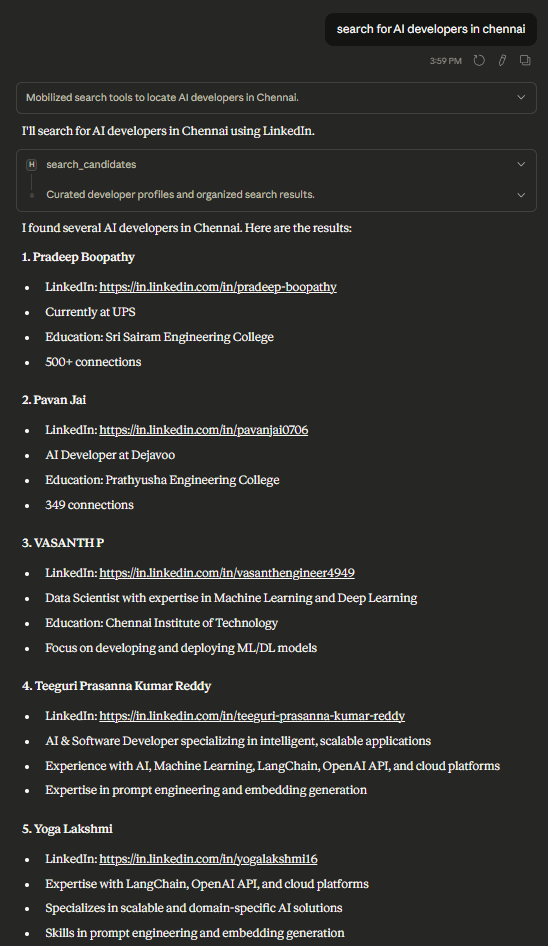
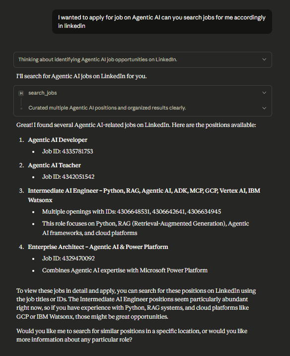

# TalentScout-MCP

A Model Context Protocol (MCP) server that acts as an intelligent HR Assistant. It connects your AI agents (like Claude Desktop) to LinkedIn, allowing them to search for candidates and jobs autonomously.

## Features

-   **Search Candidates**: Uses "X-Ray Search" (via search engines) to find public LinkedIn profiles matching specific skills and locations.
-   **Search Jobs**: Connects to LinkedIn's job search to find active listings.
-   **Profile Inspection**: Retrieves detailed profile information (where available).

## Project Structure

```
TalentScout-MCP/
├── images/                 # Demo screenshots
├── .env.example           # Template for environment variables
├── .gitignore             # Git ignore rules
├── linkedin_client.py     # Core LinkedIn interaction logic (DuckDuckGo X-Ray & API)
├── README.md              # Project documentation
├── requirements.txt       # Python dependencies
├── server.py              # FastMCP server implementation
└── test_credentials.py    # Script to verify LinkedIn credentials
```

## Demo

**Candidate Search**
[](images/candidate_search_demo_v2.png)

**Job Search**
[](images/job_search_demo_v2.png)

## Prerequisites

-   Python 3.10+
-   A LinkedIn account (for cookies)
-   `uv` or `pip` for installation

## Installation

1.  **Clone the repository**:
    ```bash
    git clone https://github.com/Sharan-Kumar-R/TalentScout-MCP.git
    cd TalentScout-MCP
    ```

2.  **Create a Virtual Environment**:
    ```bash
    python -m venv venv
    # Windows:
    venv\Scripts\activate
    # Mac/Linux:
    source venv/bin/activate
    ```

3.  **Install Dependencies**:
    ```bash
    pip install -r requirements.txt
    ```

4.  **Configure Environment**:
    -   Rename `.env.example` to `.env`.
    -   Open `.env` and fill in your LinkedIn credentials.
    -   **How to get Cookies (Recommended method to avoid 2FA/Auth issues):**
        1.  Open your browser and log in to [LinkedIn](https://www.linkedin.com).
        2.  Right-click anywhere on the page and select **Inspect** (or press F12).
        3.  Go to the **Application** tab (Chrome/Edge) or **Storage** tab (Firefox).
        4.  In the sidebar, expand **Cookies** and select `www.linkedin.com`.
        5.  Find the cookie named `li_at`. Copy its **Value** and paste it into `LINKEDIN_LI_AT=` in your `.env`.
        6.  Find the cookie named `JSESSIONID`. Copy its **Value** (including the quotes, e.g., `"ajax:..."`) and paste it into `LINKEDIN_JSESSIONID=` in your `.env`.

## Usage

### 1. Test the Connection
Run the included test script to verify your credentials are working:
```bash
python test_credentials.py
```

### 2. Run with MCP Inspector
You can use the [MCP Inspector](https://github.com/modelcontextprotocol/inspector) to test the server and tools interactively.
```bash
npx @modelcontextprotocol/inspector python server.py
```
*Requires Node.js and npx.*

### 3. Run the Server Standalone
This server runs over standard input/output (stdio) by default. You can run it directly to check for immediate startup errors:
```bash
python server.py
```
*Note: The server will wait for JSON-RPC messages on stdin. This is normal behavior.*

### 4. Connect to Claude Desktop
Add the following to your `claude_desktop_config.json`:

```json
{
  "mcpServers": {
    "hr-agent": {
      "command": "path/to/your/venv/Scripts/python.exe",
      "args": [
        "path/to/your/hr-agent-mcp/server.py"
      ]
    }
  }
}
```

## Security Note
This tool uses your personal LinkedIn cookies. Do not share your `.env` file. Using automation on LinkedIn carries a risk of temporary account restriction if used excessively. Use responsibly.

## Contributing

1. Fork the repository
2. Create a feature branch
3. Make your changes
4. Add tests if applicable
5. Submit a pull request

In case of any queries, please leave a message or contact me via the email provided in my profile.

---

<p align="center">
⭐ <strong>Star this repository if you found it helpful!</strong>
</p>
